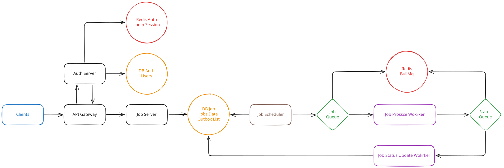

<h1 align="center">Job Manager</h1>

<p align="center">A full-stack job-processing application with authenticated job management, live progress, and reliable background execution.</p>

## Overview

Job Manager lets users create and follow asynchronous jobs from a browser. The backend separates HTTP, job persistence, scheduling, and execution responsibilities, using a transactional outbox and BullMQ to hand work to background workers reliably.



## Quick start

### Prerequisites

- Docker Desktop with Docker Compose
- Node.js 26 and pnpm 11 only if you intend to run services outside Docker

1. Create your local environment file.

   ```sh
   cp .env.exmple .env
   ```

2. Set `POSTGRES_USER`, `POSTGRES_PASSWORD`, and `BETTER_AUTH_SECRET` in `.env`. Keep `BETTER_AUTH_URL` and `CLIENT_URL` aligned with the public addresses you use.

3. Start the stack.

   ```sh
   docker compose up --build
   ```

4. Open [http://localhost:8080](http://localhost:8080), register an account, and create a job.

> [!NOTE]
> Compose runs database migrations before the dependent services start. The browser reaches the client on port `8080`; the API gateway is exposed on `3000` by default.

To stop the stack, press `Ctrl+C`, then run `docker compose down`. Add `-v` only when you intentionally want to remove the local database volumes.

## Repository layout

```text
.
├── client/              # React single-page application
├── server/              # NestJS services, shared contracts, Prisma schemas
├── docker-compose.yml   # Complete local environment
└── .env.exmple          # Environment-variable template
```

See the component guides for application-specific commands and details:

- [Client README](./client/README.md)
- [Server README](./server/README.md)

## Configuration

The included [.env.exmple](./.env.exmple) documents the variables used by Docker Compose. The essential values are:

| Variable                              | Purpose                                                    |
| ------------------------------------- | ---------------------------------------------------------- |
| `POSTGRES_USER` / `POSTGRES_PASSWORD` | Credentials used for both PostgreSQL instances             |
| `BETTER_AUTH_SECRET`                  | Secret used to secure authentication                       |
| `BETTER_AUTH_URL`                     | Public URL of the API/auth endpoints                       |
| `CLIENT_URL`                          | Public URL of the browser client, used as a trusted origin |

## Health checks

With the stack running, check the gateway at [http://localhost:3000/health](http://localhost:3000/health). Docker Compose also checks the auth and job services before starting their dependants.
